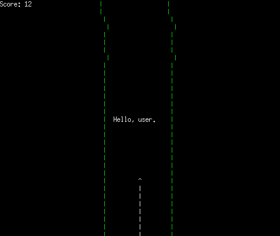

# ASCII-Canyon
School project: An ASCII game
Sofiane DJERBI & Aksel PERRIGAULT

  

## Build
Build and run: `make run`
You can edit `Makefile`'s `DEFLAGS` in order to change program flags.
## Compiler flags
Don't forget to `make clean` when changing flags.
### Program flags
- `-DDEBUG` show speed/wallsize
- `-DWALLREDUCTION` activate dynamic wall reduction
- `-DSTORY` enable story mode

### Variables
- `-DMAX_SPEED=x` set max speed to x
- `-DMIN_WALLSIZE=x` set the minimum wall size to x
- `-DCURSOR_HEIGHT=x` set the default height of the cursor to x
- `-DHZ=x` if not def: auto speed incrementation; if def: set clock to x HZ
- `-DWALLSIZE=x` set default wall size to x
- `-DWALL=\'c\'` set the wall to the c character
- `-DCURSOR=\"c\"` set the cursor to the c character
- `-DTRAIL=\"c\"` set the trail to the c character
